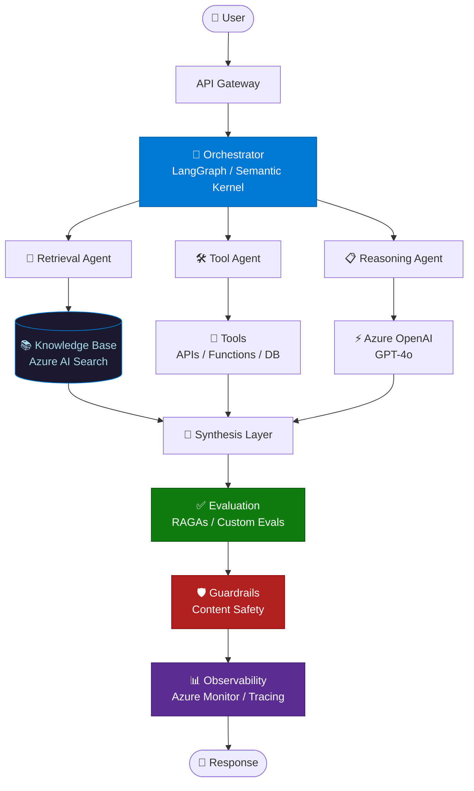

<div align="center">


</div>

<div align="center">

[](https://www.linkedin.com/in/maneesh-kumar-69694566/)&nbsp;
[](https://github.com/maneeshkumar52)&nbsp;
[](https://github.com/maneeshkumar52?tab=followers)&nbsp;
[](https://github.com/maneeshkumar52)

</div>

<br/>

---

## ⚡ What I Build

> **End-to-end Agentic AI & Enterprise RAG systems** — from architecture to production on Azure.  
> Multi-agent orchestration · Retrieval pipelines · Enterprise copilots · Evaluation & observability.

I'm an **AI Architect** with deep specialization in **Agentic AI** and **Enterprise RAG** on Azure. I've designed and shipped production AI platforms across **Banking, Healthcare, HR, Legal, and E-commerce** — working across **WinWire Technologies**, **Microsoft**, and **Accenture**.

I don't just prototype. I architect systems that scale.

---

## 🏗️ Architecture Signature



---

## 📘 Featured Book

<br/>

**From Prompts to Agentic AI**  
*Building Agentic AI & Enterprise RAG Systems on Azure*

A practitioner's guide to designing and shipping production-grade AI systems — covering enterprise RAG architectures, agentic orchestration with AutoGen & Semantic Kernel, evaluation frameworks, guardrails, and Azure-native deployment patterns.

&nbsp;&nbsp;&nbsp;📖&nbsp; [Kindle Edition](https://www.amazon.in/dp/B0GRD8XTHH)&nbsp;&nbsp;·&nbsp;&nbsp;📗&nbsp; [Paperback](https://www.amazon.in/dp/B0GTLDQSSW)&nbsp;&nbsp;·&nbsp;&nbsp;📕&nbsp; [Hardcover](https://www.amazon.in/dp/B0GTLGXY32)

---

## 🗂️ Enterprise AI Portfolio

### ✅ Recently Standardized (Architect-Grade)

All repositories below were refreshed with professional README structure (architecture, setup, execution, validation, troubleshooting) and validated for source-level syntax readiness.

| Repository | Focus Area |
|---|---|
| [multi-agentic-ai](https://github.com/maneeshkumar52/multi-agentic-ai) | Multi-agent research and governance pipeline |
| [banking-support-agent](https://github.com/maneeshkumar52/banking-support-agent) | Banking support automation |
| [contoso-research-system](https://github.com/maneeshkumar52/contoso-research-system) | Enterprise research orchestration |
| [contoso-support-agent](https://github.com/maneeshkumar52/contoso-support-agent) | Multi-service customer support agents |
| [ecommerce-assistant](https://github.com/maneeshkumar52/ecommerce-assistant) | Conversational commerce assistant |
| [enterprise-copilot](https://github.com/maneeshkumar52/enterprise-copilot) | Enterprise copilot platform |
| [executive-briefing-system](https://github.com/maneeshkumar52/executive-briefing-system) | Executive intelligence briefing |
| [financial-research-system](https://github.com/maneeshkumar52/financial-research-system) | Financial research automation |
| [fraud-analysis-assistant](https://github.com/maneeshkumar52/fraud-analysis-assistant) | Fraud analysis and risk triage |
| [healthcare-clinical-rag](https://github.com/maneeshkumar52/healthcare-clinical-rag) | Clinical RAG workflows |
| [hr-policy-rag](https://github.com/maneeshkumar52/hr-policy-rag) | HR policy-grounded retrieval |
| [it-ticketing-agent](https://github.com/maneeshkumar52/it-ticketing-agent) | IT ticket routing and agentic support |
| [legal-document-analyser](https://github.com/maneeshkumar52/legal-document-analyser) | Legal document intelligence |
| [github-repo-documentation](https://github.com/maneeshkumar52/github-repo-documentation) | Automated repository documentation |
| [rag-app](https://github.com/maneeshkumar52/rag-app) | Full-stack RAG platform |
| [agent_voxcpm](https://github.com/maneeshkumar52/agent_voxcpm) | Voice-enabled multi-agent system |
| [pageindex-enterprise-wiki](https://github.com/maneeshkumar52/pageindex-enterprise-wiki) | Enterprise wiki and retrieval portal |
| [HR_Copilot](https://github.com/maneeshkumar52/HR_Copilot) | HR multi-agent employee copilot |
| [llm-wiki](https://github.com/maneeshkumar52/llm-wiki) | Local-first knowledge wiki assistant |

### 🧠 Core Platforms

| Repository | What it does |
|---|---|
| [rag-app](https://github.com/maneeshkumar52/rag-app) | Production RAG pipeline — Azure AI Search, chunking strategies, reranking |
| [enterprise-copilot](https://github.com/maneeshkumar52/enterprise-copilot) | Multi-domain enterprise copilot with orchestration and routing |
| [executive-briefing-system](https://github.com/maneeshkumar52/executive-briefing-system) | AI-powered executive intelligence and document summarization |
| [financial-research-system](https://github.com/maneeshkumar52/financial-research-system) | Automated financial research and market intelligence platform |

### 🏦 Banking & Financial AI

| Repository | What it does |
|---|---|
| [banking-support-agent](https://github.com/maneeshkumar52/banking-support-agent) | Multi-agent system for banking queries, accounts, and transactions |
| [fraud-analysis-assistant](https://github.com/maneeshkumar52/fraud-analysis-assistant) | AI-driven fraud detection and case analysis assistant |

### 🏥 Healthcare AI

| Repository | What it does |
|---|---|
| [healthcare-clinical-rag](https://github.com/maneeshkumar52/healthcare-clinical-rag) | Clinical RAG system for medical workflows and documentation |

### ⚖️ Legal AI

| Repository | What it does |
|---|---|
| [legal-document-analyser](https://github.com/maneeshkumar52/legal-document-analyser) | Contract and legal document analysis with semantic reasoning |

### 👥 HR & Enterprise Automation

| Repository | What it does |
|---|---|
| [HR_Copilot](https://github.com/maneeshkumar52/HR_Copilot) | Multi-agent HR copilot for employee self-service workflows |
| [hr-policy-rag](https://github.com/maneeshkumar52/hr-policy-rag) | Policy-grounded RAG system for HR knowledge retrieval |
| [it-ticketing-agent](https://github.com/maneeshkumar52/it-ticketing-agent) | Intelligent IT support agent with ticket classification and routing |

### 🛒 Customer & Commerce

| Repository | What it does |
|---|---|
| [ecommerce-assistant](https://github.com/maneeshkumar52/ecommerce-assistant) | Conversational commerce AI with product discovery and recommendations |
| [contoso-support-agent](https://github.com/maneeshkumar52/contoso-support-agent) | Enterprise customer support agent with memory and escalation |
| [contoso-research-system](https://github.com/maneeshkumar52/contoso-research-system) | Business intelligence and research automation system |

---

## 🛠️ Tech Stack

**AI & Orchestration**


**Cloud & Infrastructure**


**Backend & Engineering**


---

## 🎯 Expertise

```
Enterprise RAG Architecture        ████████████████████  Expert
Azure OpenAI Integration           ████████████████████  Expert
Agentic AI & Orchestration         ████████████████████  Expert
Multi-Agent System Design          ███████████████████░  Advanced
AI Evaluation & Observability      ███████████████████░  Advanced
MLOps & Production Deployment      ██████████████████░░  Advanced
```

---

## 💡 Thought Leadership

- 📘 **Published Author** — *From Prompts to Agentic AI* (Kindle · Paperback · Hardcover)
- 🎤 **Conference Speaker** — MLDS 2026: *"HR Copilot: Multi-Agent Employee Self-Service System"*
- ✍️ **Content Creator** — Running **#100DaysOfAgenticAI** series on Medium & LinkedIn
- 🏅 **Certified** — 9× Microsoft & Anthropic certifications including **Claude Certified Architect**

---

## 📊 GitHub Activity

<div align="center">


</div>

<div align="center">


</div>

---

## 📬 Let's Connect

<div align="center">

[](https://www.linkedin.com/in/maneesh-kumar-69694566/)&nbsp;&nbsp;
[](https://github.com/maneeshkumar52)&nbsp;&nbsp;
[](https://www.amazon.in/dp/B0GRD8XTHH)

</div>

<br/>

<div align="center">


</div>
